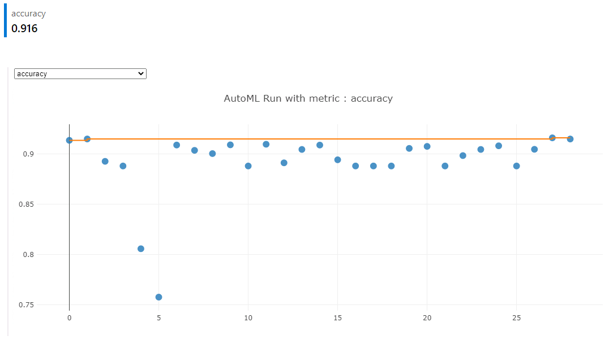

# Optimizing an ML Pipeline in Azure

## Overview
This project is part of the Udacity Azure ML Nanodegree.
In this project, we build and optimize an Azure ML pipeline using the Python SDK and a provided Scikit-learn model.
This model is then compared to an Azure AutoML run.

## Summary
### Problem
- This project uses a Bank Marketing Dataset from the [USI Machine Learning Repository](https://archive.ics.uci.edu/ml/datasets/Bank+Marketing).
- The dataset conatins personal details about clients such as age, job, marital status, education, etc among other attributes. 
- This is a **_classification_** (2 class-classification) problem with the goal to predict whether or not a client will subscribe to a term deposit with the bank. 
- The data is classified using the column label y in the dataset that contains binary values ('yes' and 'no').

### Project Workflow Steps

### Solution Approach
- This project used two approaches to find the best possible model for classifying the given dataset:
  1. Scikit-Learn based logistic regression using the HyperDrive for hyperparameter tuning
  1. Automated Machine Learning was used to build and choose the best model
  *Both these approaches were extecuted using _Jupyter Notebook and the Azure ML SDK_.
 
### Results
* The best performing model was a **_VotingEnsemble_** algorithm that was selected through AutoML with an accuracy of **91.60%**.
* The Logistic Regression model whose hyperparameters were tuned using HyperDrive gave an accuracy of **91.02%**.

## (i) Scikit-learn Pipeline
In this solution, a Scikit-learn logistic regression algorithm was used to solve the classification problem. The hyperparameters for this model was tuned using hyperdrive package to choose the best combination seeking maximize the accuracy of the model.

### Data preparation
In order to fed the hyperdrive package, clean the data was necessary using clean_data() function. This function receives a dataset transformed by TabularDatasetFactory object and returns two pandas dataframes: the x dataframe containing all the features preprocessed with one hot ecoding and the y dataframe containing the target values for the model. After that de main() method splits the data into train and test arrays by the 3/1 ratio. Then the logistic regression model is created taking 2 hyperparameters: `--C`, which is the inverse of regularization strength and `--max-iter`, which is the maximum number of iterations that should be taken to converge. The code for this tasks can be access in the [train.py file](https://github.com/ramonsfreitas/Optimizing-an-ML-Pipeline-in-Azure/blob/main/train.py)

### Hyperparameter Tuning using HyperDrive
- The HyperDrive package is used to optimize tuning of hyperparameters by using the HyperDriveConfig() that takes in several configuration attributes:
  1. Estimator (`est`): An `SKLearn` estimator is used to begin the training and invoke the training script file.
  1. Parameter sampler (`hyperparameter_sampling `): A `RandomParameterSampling` sampler is used to randomly select values specified in the search space for the two parameters of Logistic Regression algorithm (--c and --max_iter). It is faster and supports early termination of low-performance runs. Random Sampling works with both discrete and continous search space unlike Grid Sampling. It also supports early termination policy unlike Bayesian Sampling. Hence Random Sampler helps in performing trial and error with values chosen over the search space and then refine the search space in subsequent runs to obtain best results.
  1. Policy (`policy`): An early termination policy, `BanditPolicy`, is passed to ensure low performing runs are terminated and resources are not wasted. Early stopping helps in avoiding unnecessary usage of resources assigned to runs that performs poorly. This is ensured by terminating runs whose primary metric is not within the slack amount specified by the policy. 
  `BanditPolicy` is based on slack factor/slack amount and evaluation interval. Bandit ends runs when the primary metric isn't within the specified slack factor/slack amount of the most successful run. Configuration of Badit policy requires the follow parameters:
      * slack_factor or slack_amount: the slack allowed with respect to the best performing training run. slack_factor specifies the allowable slack as a ratio. slack_amount specifies the allowable slack as an absolute amount, instead of a ratio.
      * evaluation_interval: (optional) the frequency for applying the policy
      * delay_evaluation: (optional) delays the first policy evaluation for a specified number of intervals
  1. Primary Metric (`primary_metric_name`): The primary metric for evaluating runs is specified. The project uses `accuracy` as the primary metric with the goal (`primary_metric_goal`) value `primary_metric_goal.MAXIMIZE` to maximize the primary metric in every run.
  1. Resources for controlling and running the experiment is specified using `max_concurrent_runs` (Maximum number of runs that can run concurrently in the experiment) and `max_total_runs` (Maximum number of training runs). 

### Best Result

The best model parameters here were a C value of 0.11090778371308053 and a max_iter value of 150. The model's accuracy was ~91.02%

## (ii) AutoML
AutoML (Automated Machine Learning) is used to simplify various time intensive Machine Learning tasks such as feature engineering, feature selection, hyperparameter selection, training, etc. This approach uses AutoML to automate the process of choosing an algorithm, and the values of hyperparameters for the chosen algorithm that will result in the best model with the highest accuracy.

### Data preparation
The same function used in the (i) aproach was used in this, clean_data() function. In order to take the same dataset enabling compare those differents aproachs, the data was split into train and test arrays by the 3/1 ratio.

#### Configuration
The `AutoMLConfig` object takes attributes required to configure the experiement run such as: 
- Experiment Timeout (`experiment_timeout_minutes`) = 30: Maximum amount of time (in minutes) that all iterations combined can take before the experiment terminates. 
- Task to be performed (`task`): The tpye of task that needs to be run such as classification, regression, forecasting etc. In this project `classification` is the task to be performed.
- Primary Metric (`primary_metric`): The primary metric which is used to evaluate every run. In this case, `accuracy` is the primary metric to be evaluated.
- Training Data (`training_data`) = The _TabularDataset_ that contains the training data.
- Label Column (`label_column_name`): Name of the column that needs to be predicted. In this case the column that contains "yes" or "no" to perform classification.
- Cross Validations (`n_cross_validations`) = 5: Specifies the number of cross validations that needs to be performed on each model by splitting the dataset into n subsets.

### Best Result

The best model chose nu the AutoML mehotd was VotingEnsemble method, getting a accuracy of **91.60%**. A Voting Classifier is a machine learning model that trains on an ensemble of numerous models and predicts an output (class) based on their highest probability of chosen class as the output.
It simply aggregates the findings of each classifier passed into Voting Classifier and predicts the output class based on the highest majority of voting. The idea is instead of creating separate dedicated models and finding the accuracy for each them, we create a single model which trains by these models and predicts output based on their combined majority of voting for each output class.

Voting Classifier supports two types of votings.

1. Hard Voting: In hard voting, the predicted output class is a class with the highest majority of votes i.e the class which had the highest probability of being predicted by each of the classifiers. Suppose three classifiers predicted the output class(A, A, B), so here the majority predicted A as output. Hence A will be the final prediction.

2. Soft Voting: In soft voting, the output class is the prediction based on the average of probability given to that class. Suppose given some input to three models, the prediction probability for class A = (0.30, 0.47, 0.53) and B = (0.20, 0.32, 0.40). So the average for class A is 0.4333 and B is 0.3067, the winner is clearly class A because it had the highest probability averaged by each classifier.

The list of the models in each run and its accuracy can be view at the images below.

The Best Model given by AutoML is using SoftVoting.

The VotingClassifier Used below list of estimators
* XGBoostClassifier
* LightGBMClassifier
* LogisticRegression

## Pipeline comparison
* The experiment run and model trained for the datsaset using AutoML gave a higher accuracy (0.9160) than the model trained using Scikit-learn pipeline (0.9102) for the same dataset.
* Although the difference in accuracy between the two approaches is not large, this difference can be attributed to the difference in pipeline architecture and experiment steps.
* The experiment run using the scikit-learn architecture only uses one algorithm- Logistic Regression. Whereas the experiment run using AutoML tests various algorithms for the same dataset to find the best model.
* The hyperparameter search space, and the sampling method was manually entered in the HyperDrive experiment but experiment run using AutoML tuned and optimized this search for hyperparameters to find the best suitable model.
* Early termination policy was also mentioned in the HyperDrive experiment but that was chosen automatically in the AutoML experiment.
* The very less difference in accuracy for the two approaches can also be attributed by the fact the same dataset was used for both the runs.
* Also, it can be time consuming to try out different Algorithms for the HyperDrive experiment since different pipelines need to be built for every possible algorithm.
* It was also observed that the AutoML approach required less manual intervention and coding compared to the HyperDrive approach.
* AutoML based pipeline can use other models like Deep Learning based or from other library.

## Future work
- This dataset is imbalanced as mentioned earlier. If model is predicting well for mejority class. It will give better Accuracy and still fail to perform well on minority class. We should consider this problem as Class Imbalance Classfication problem. Accuracy is not the right metric to be considered in such cases.
   There are several ways to handle this probelm, 
   1. Consider F1 score or Recall or AUC as primary Matrix for model Selection since it is less affected by Imbalance data
   2. Change the algorithm : While in every machine learning problem, it’s a good rule of thumb to try a variety of algorithms, it can be especially beneficial with imbalanced datasets. Decision trees frequently perform well on imbalanced data. They work by learning a hierarchy of if/else questions and this can force both classes to be addressed.
   3. Try Upsampling(Oversampling) or Downsampling(Undersampling) techniques to reduce imbalance in data
- For the HyperDrive experiment, Grid Sampling can be used as the sampling method to conduct an exhaustive search for hyperparameters to try for better accuracy.
- Various pipelines can also be built for the HyperDrive experiment for different kinds of algorithms that were used in AutoML experiment.
- Theoretically, a thorough review and study of the technique behind AutoML approach can be performed which can then be applied to the HyperDrive experiment.
- The Class balancing problem can be reviewed and fixed to decrease bias to avoid falsely perceived positives.
- In the HyperDrive run experiment the search space can be changed and explored further using trial and error method to obtain better metric goals.

## Resources
* [Udacity Machine Learning Engineer with Microsoft Azure Nanodegree Program](https://classroom.udacity.com/nanodegrees/nd00333/parts/e0c51a58-32b4-4761-897b-92f6183148ac)
* [Microsoft Official Documentation for Azure ML](https://docs.microsoft.com/en-us/azure/machine-learning/)
* [Scikit-Learn Logistic Regression](https://scikit-learn.org/stable/modules/generated/sklearn.linear_model.LogisticRegression.html)
* [Scikit-Learn Train and Test Spli Data](https://scikit-learn.org/stable/modules/generated/sklearn.model_selection.train_test_split.html)
* [how-to-configure-auto-train-in-azure](https://docs.microsoft.com/en-us/azure/machine-learning/how-to-configure-auto-train)
* [how-to-tune-hyperparameters-in-hyperdrive](https://docs.microsoft.com/en-us/azure/machine-learning/how-to-tune-hyperparameters)
* [ml-voting-classifier-using-sklearn](https://www.geeksforgeeks.org/ml-voting-classifier-using-sklearn/)
* [Why-is-XGBoost-better-than-logistic-regression](https://www.quora.com/Why-is-XGBoost-better-than-logistic-regression)
* [methods-for-dealing-with-imbalanced-data](https://towardsdatascience.com/methods-for-dealing-with-imbalanced-data-5b761be45a18)
* [feature-selection-dimensionality-reduction-techniques-to-improve-model-accuracy](https://towardsdatascience.com/feature-selection-dimensionality-reduction-techniques-to-improve-model-accuracy-d9cb3e008624)
